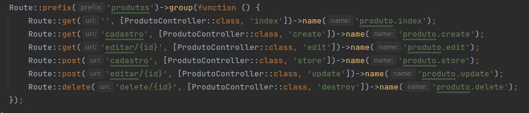
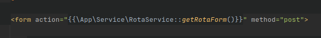

# CRUD SIMPLES

Esse é um projeto de demonstração de um crud simples em laravel.

## Rotas
A única complexidade fica por conta do menu de cada resource **(resource/views/produto/menu.blade.php)** e da monatgem das rotas automáticas que estão em **app/Service/RotaService.php**

A ideia por trás da automação é seguir o padrão dos **names** conforme a imagem abaixo, e o **RotaService** irá montar todas as rotas nos **blades**.

Ex.: No blade de formulário de produtos, que serve tanto para inserir quanto para alterar, utilizando o método estático **getRotaForm()** irá criar automaticamente o redirecionamento, trazendo inclusive o id do produto no caso de edição.  

